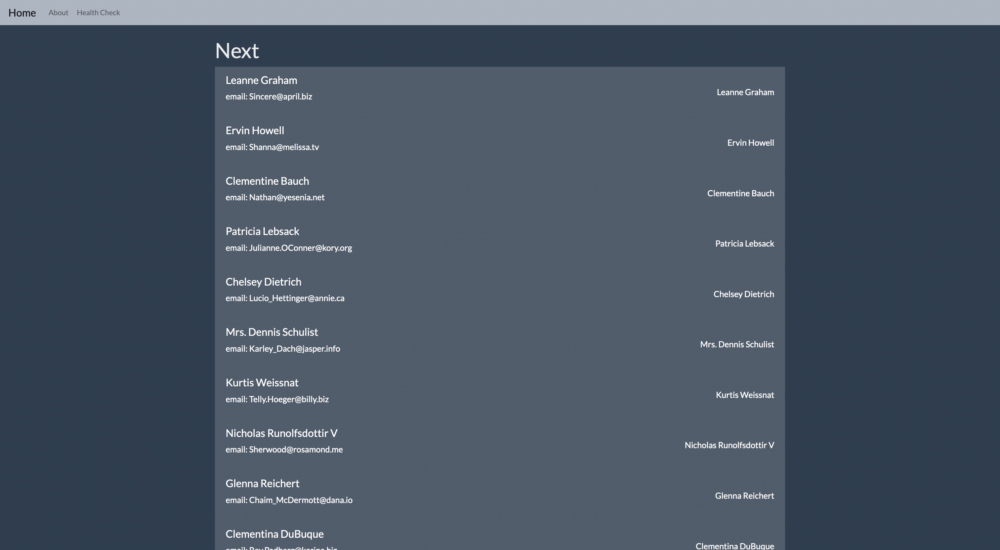

# NextJSPlayground


NextJS playground that let me learn the sintax. Taken from [here](https://www.youtube.com/watch?v=Tn6QYliFBcs&t).



## Setup

    ```bash
    npm install next react react-dom
    ```

    ```bash
    npm install --save-dev typescript @types/react @types/node
    ```

## Run

    ```bash
    npm run dev
    ```
